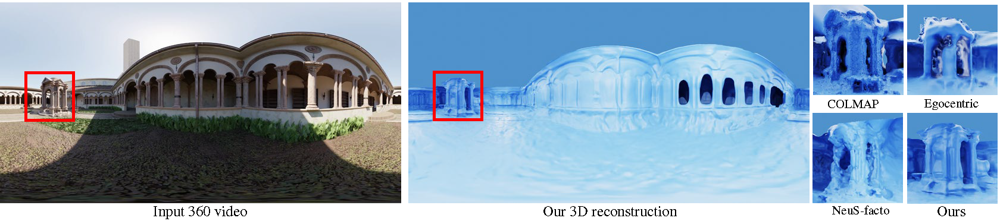

# OmniSDF: OmniSDF: Scene Reconstruction using Omnidirectional Signed Distance Functions and Adaptive Binoctrees
---
### [Project Page](https://vclab.kaist.ac.kr/cvpr2024p2/index.html) | [Paper](https://vclab.kaist.ac.kr/cvpr2024p2/OmniSDF.pdf) | [Dataset]()


[Hakyeong Kim](https://sites.google.com/view/hakyeongkim),
[Andréas Meuleman](https://ameuleman.github.io/),
[Hyeonjoong Jang](http://vclab.kaist.ac.kr/hjjang/),
[James Tompkin](https://jamestompkin.com/),
[Min H. Kim](http://vclab.kaist.ac.kr/minhkim/)

This repository is the official implementation of the paper **OmniSDF: OmniSDF: Scene Reconstruction using Omnidirectional Signed Distance Functions and Adaptive Binoctrees** presented in CVPR 2024.



## Tested Environments
> * OS  :  Ubuntu 20.04.5 LTS   
> * GPU : NVIDIA RTX A6000
> * CUDA toolkit ver. >=12.0

## Dataset convention
We provide synthetic [dataset]() for the demo.
Unzip files in ```./data/input_video```.   
Input data are organized as follow
```
<scene_name>
|-- idepth              # Inverse depth extracted from pretrained network
    |-- 0.exr
    |-- 1.exr
    ...
|-- traj.csv            # Camera-to-world matrix
|-- video.mp4           # Egocentric RGB video
|-- mask_img.png        # Mask image to mask out camera stick

```

## Installation
Setup environment by building docker image

```
cd env
sh docker_build.sh
```

Run docker container

```
docker run -d --gpus '"device=0"' -w /code/src/ \
-v $(pwd)/data:/data \
-v $(pwd):/code/src \
--name omnisdf \
-it omnisdf:1.0
```

Build custom CUDA library for binoctree by running below code inside the docker container.

```
cd binoctree/clib
python3 setup.py clean --all install
```
 

## Demo

To train SDF network, run below:
```
python3 main.py --mode=train --conf="./confs/sponza_demo.conf"
```
To extract mesh from trained network, run below:
```
python3 main.py --mode=validate_mesh --conf="./confs/sponza_demo.conf" --is_continue
```
* Note: Set configuration `general.debug` as False to save memory space. Running as debug mode will save point clouds of binoctree vertices during the training.

## Trained model
We provide our trained model of sponza scene.   
To extract mesh from trained network, run below:
```
python3 main.py --mode=validate_mesh --conf="./confs/sponza_release.conf" --is_continue
```


## Acknowledgement
Our code is built upon [NeuS](https://github.com/Totoro97/NeuS).
Thanks for all of these great projects.

## BibTex
Please cite as;
```
@InProceedings{Kim_2024_CVPR,
   author = {Hakyeong Kim and Andreas Meuleman and Hyeonjoong Jang and 
   James Tompkin and Min H. Kim},
   title = {OmniSDF: Scene Reconstruction using
   Omnidirectional Signed Distance Functions and Adaptive Binoctrees},
   booktitle = {IEEE Conference on Computer Vision and 
      Pattern Recognition (CVPR)},
   month = {June},
   year = {2024}
}
```